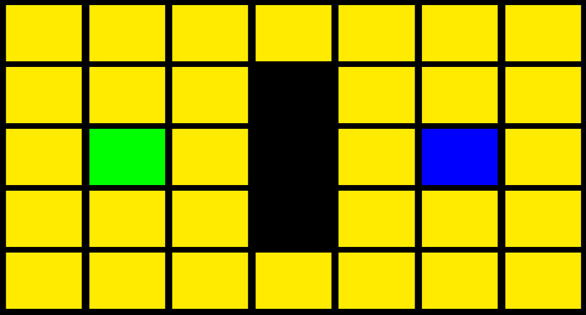
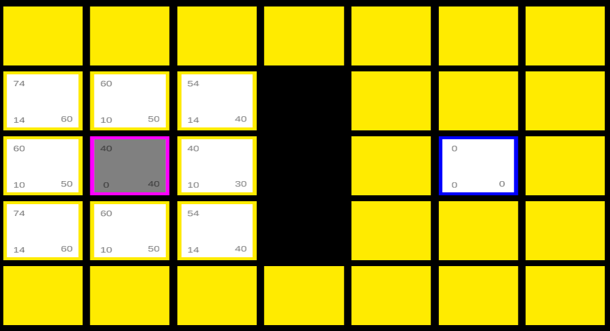
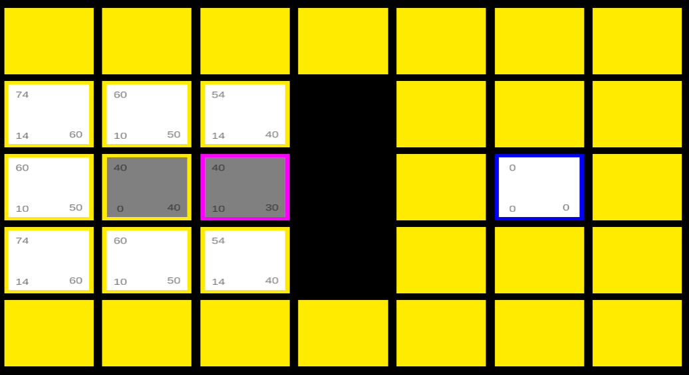
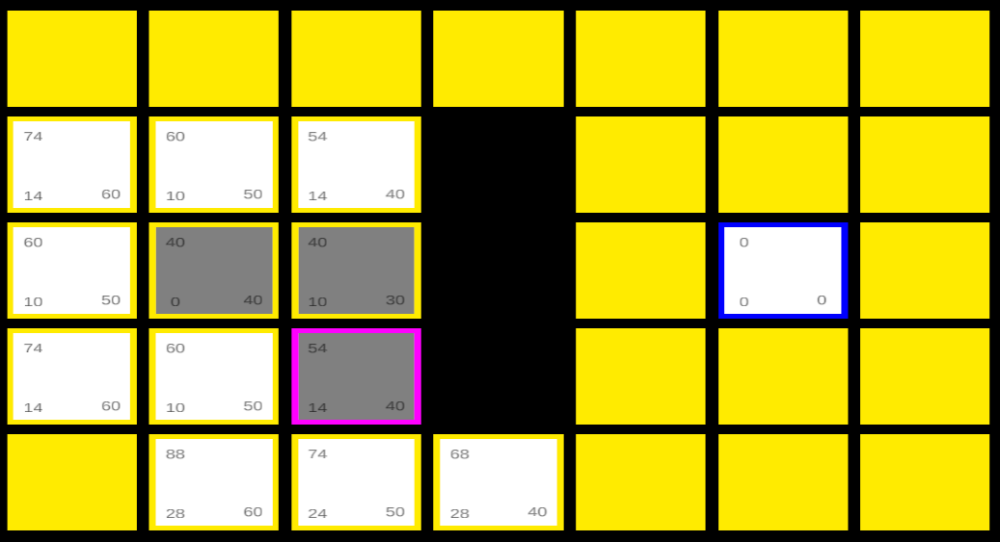
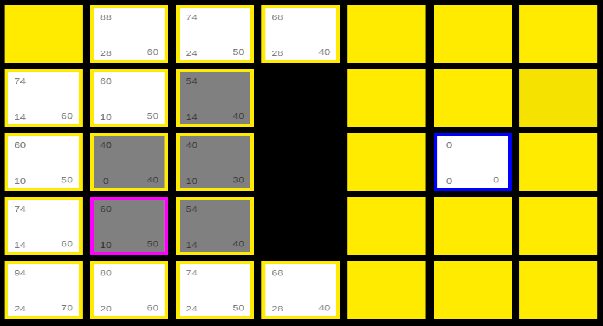
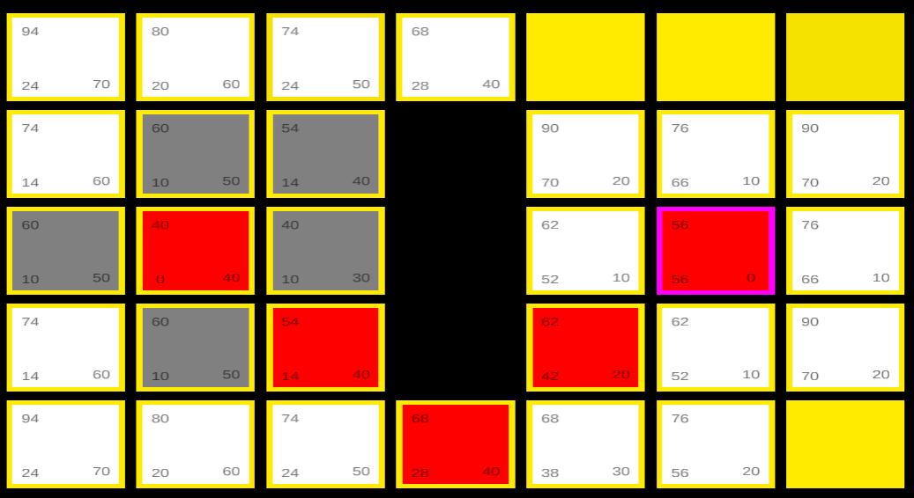

# **Algorithm: AStar**  

注意：
1. 一切斜体字注“见后文”的真实存在性以实际为准，没有就是忘了/懒

## 思路：
> 每个节点有三个属性，包括G、H、F，其中H就是AStar算法的启发式思想体现之处。每次从openSet中找出F最小的节点min，移出openSet，加入closedSet。查询该节点的子节点，并**更新子节点的属性**，然后将子节点加入到openSet中。循环上述操作，直到min=end，结束循环。
> 
> 三个属性：
>> 1. G：实际代价，表示当前节点到出发点的实际距离
>> 2. H：预估代价，表示当前节点到终点的曼哈顿距离
>> 3. F：G+H
> 
> 两个数组：
>
>> 1. openSet：储存已经探索到且未查询的节点
>> 2. closedSet：储存已查询的节点  
>
> 更新子节点属性方法：
>
>> 向min节点八个方向查找，如果可行走且未被查询过（即不在closedSet中），则计算并更新子节点的属性。  
如果子节点没有父节点，说明该节点是第一次找到，则直接设置该节点的父节点为min节点，子节点的G值等于父节点的G值加10或14（14为斜向距离，即根号2倍的10，为了方便计算直接取整）；  
如果子节点已有父节点，说明该节点还有其它可达路径，则需要比较**从min节点到该节点的路径的G值**和**该节点原本路径的G值**，如果经过min节点的路径的G值更小，则更新该节点的父节点为min节点，以及更新G值。  
子节点的H有多种启发式函数可选：
>>   1. 曼哈顿距离：节点与终点 横纵坐标之差 的绝对值 之和
>>   2. 欧几里得距离：节点与终点的直线距离
>>   3. 切比雪夫距离：在曼哈顿距离上多了斜向距离  
>>
>> 此处选择最简便的曼哈顿距离

## 例：

### 地图如图所示：

*绿色是起点，蓝色是终点，左上角为（0，0），右、下为横、纵轴正方向*

### 一，

将start加入openSet  

取openSet中F最小的节点start设为min，将其移出openSet，加入closedSet。  

查询min的子节点，八个节点都可走且都是第一次找到，则这八个节点都设置父节点为min，更新属性  

**第一次循环结束，此时的地图：**

*每个节点左上角为F值，左下角为G值，右下角为H值*

### 二，

取openSet中F最小的节点（3，3）设为min，将其移出openSet，加入closedSet。  

查询min的子节点，右边三个节点不可走，剩下五个都不是第一次找到，则需通过比较决定是否需要更新这些节点的父节点。  
例如上方的（3，2）节点，**经过min节点到达（3，2）节点的路径长度G为20，而（3，2）节点原本的路径（即经过原父节点到达该节点的路径）长度G为14**，原本路径更短，则不需要更新父节点和G值。其余四个节点同理。  

**第二次循环结束，此时的地图：**

*每个节点左上角为F值，左下角为G值，右下角为H值*

### 三，

**下面来看第三次和第五次循环，注意节点（2，5）**  

第三次循环结束后的地图：

如上图，第三次循环查询了（3，4）节点，此时（2，5）的父节点为（3，4），G值为28  

第五次循环结束后的地图：

如上图，第三次循环查询了（2，4）节点，当查找（2，4）的子节点，找到（2，5）时，由于（2，5）已有父节点，则进行比较。经过（2，4）节点到达（2，5）节点的G为20，比原G值小，则更新（2，5）的父节点为（2，4），G值为20，H值不变

### 四，

按照以上步骤循环，直到从openSet取出的min为end，则找到终点，结束循环，从终点处反向搜索Parent节点，将找出的路径标记为红色显示出来，到此AStar算法结束。

**结束后的地图：**
