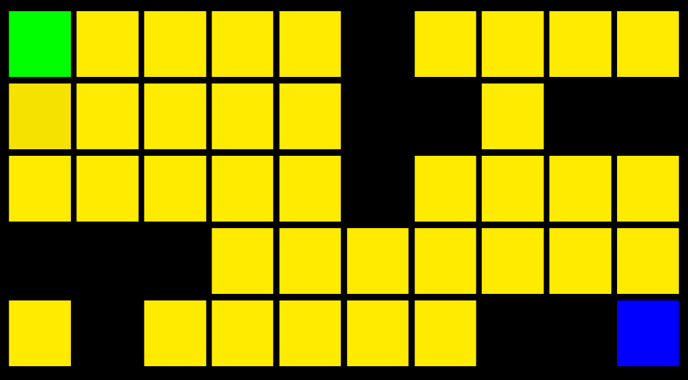
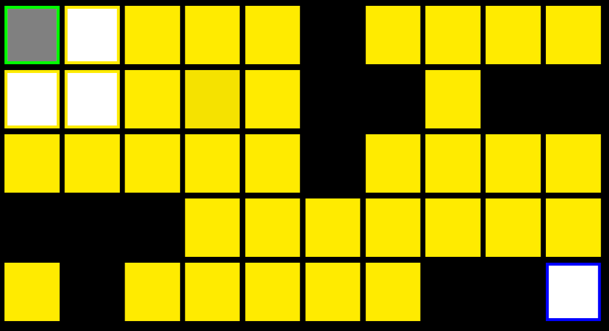
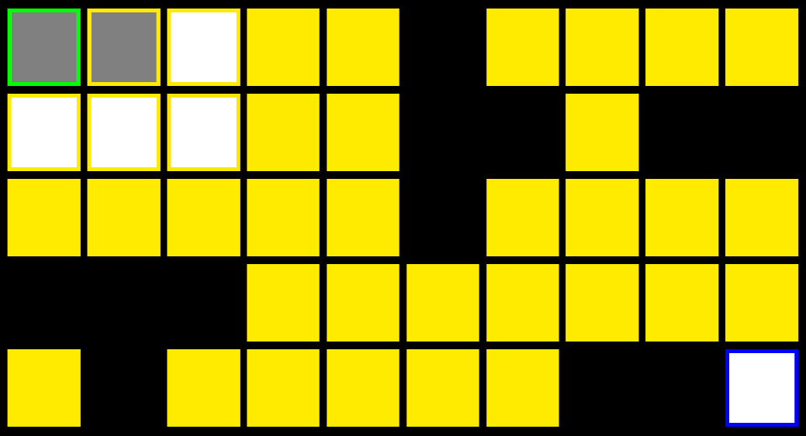
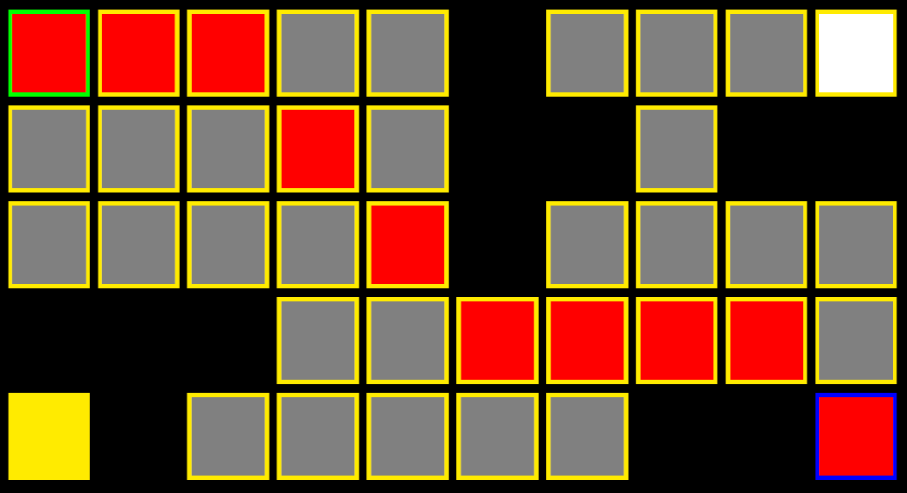

# **Algorithm: Dijkstra**  

注意：
1. 此贴中算法为未经堆优化的DIjkstra算法，*堆优化版本见后文*
2. 一切斜体字注“见后文”的真实存在性以实际为准，没有就是忘了/懒

## 思路：

> 两个数组：
>
>> 1. openSet：储存已经探索到且未查询的节点
>> 2. closedSet：储存已查询的节点
>
> 每次从openSet中找出到start节点的距离D最近的节点min，则到达min节点的最短路径已经确定，将min移出openSet，加入closedSet。接着查找min节点的子节点，将其加入openSet中。循环以上操作，直到取出的最近节点min为end节点，退出循环。  
> 查找子节点方法：
>
>> 向八个方向前进一步，如果节点在地图内且不是障碍物，且没有被查询过
（即isChecked=false，确保每个节点只需要有一条路径可以到达它，这与在抽象的图中使用Dijkstra时有所不同，*分析见后文*），
则加入到openSet中，并设置新的节点的父节点为原节点。

## 例：

### 地图如图所示：

### 一，

先将start加入到openSet，设置start的D为0，并且把start.isChecked设为true（这个的作用后文会解释），然后进入循环，循环条件为openSet的长度大于0（因为每次查询一个节点都会将该节点移出openSet，也就是说当openSet长度为0时所有可查询到节点到start的最短路径都找到了）。  

遍历openSet找出距离D最小的节点，此时即为唯一的节点start，记为min，则start的最短路径已找到  

移出openSet、加入closedSet  

查找start的子节点  

* 五个方向的子节点均不可走
* 把右、下、右下节点加入openSet

第一次循环结束  

**此时openSet包含：（1,2）10，（2,1）10，（2,2）14（括号后数字为节点的D值）**  

### 二，

遍历openSet找出距离D最小的节点，为节点（2,1）（或者（1,2），取决于哪个先被加入openSet），记为min，则（2,1）的最短路径已找到  

移出openSet、加入closedSet  

查找（2,1）的子节点  

* 上三个方向的子节点不可走
* 左、左下、下的节点不可走
* 把右、右下的节点加入openSet  

第二次循环结束

**此时openSet包含：（3,1），（2,1），（2,2），（3,2）**  

### 三，

经过循环n次后，当取出end节点时，循环结束，从终点处反向搜索Parent节点，将找出的路径标记为红色显示出来，到此Dijkstra算法结束。  

**最终的地图：**

## 堆优化

不难发现，这里每次循环中又会嵌套一个循环，用来查找D值最小的节点，这会使得算法的时间复杂度为O(n^2)，有些过长了。所以可以用“堆”这一数据结构来优化算法：使openSet成为小顶堆，那么我们每次循环只需要取出顶端的节点就是最小的了，然后每次加入新节点到openSet时维护一下堆的性质即可，这样时间复杂度就减少为了O(mlog(n))。